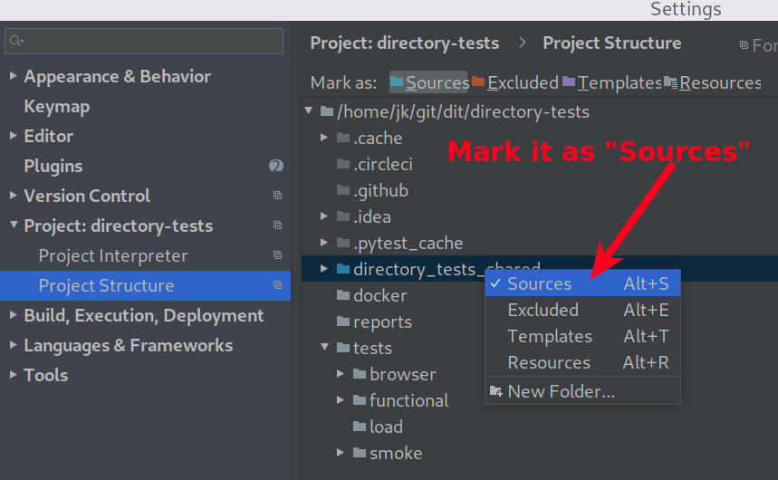

GREAT platform - Shared test code
---------------------------------

This package contains various utility and convenience methods used by:
* Browser (BDD)
* Functional (BDD)
* Load
* Smoke
tests.

Apart from aforementioned utility methods there are three particularly important modules:
* [settings.py](directory_tests_shared/directory_tests_shared/settings.py) - contains common (global) variables
* [clients.py](directory_tests_shared/directory_tests_shared/clients.py) - initialize various API clients
* [urls.py](directory_tests_shared/directory_tests_shared/urls.py) - a unified source of URLs used across the tests


## Installing

This package is automatically installed with all other dependencies specific to `browser`, `functional`, `load`, `periodic_tasks` or `smoke` tests.  
(see general [installation](../README.md#Installing) instructions in main README)

If you decide to install this package manually, then you can install it in `editable` mode for all test suites
except for `Browser (BDD)` using `-e` switch:

```bash
pip install -e ./directory_tests_shared
```

`Editable` model allows you to make changes to this package whilst working on lets say `Smoke` tests without the need to reinstall the package.

It's not possible to install this package in `editable` mode for `Browser (BDD)` tests because these two projects don't
share the same namespace. For more in-depth explanation please see [Different namespace](../tests/browser/README.md#Different-namespace).

The `-e` switch is optional and can be omitted if `editable` mode is not required:
```bash
pip install ./directory_tests_shared
```


### Requirements

To install all dependencies:

```bash
make requirements_tests_shared
```

To compile new requirements.txt
```bash
make compile_requirements_tests_shared
```

Unpinned requirements are specified in [./requirements.in](./requirements.in).  
Just like with all other requirements files we do use `pip-compile` (part of [pip-tools](https://pypi.org/project/pip-tools/) package) to compile new version of [./requirements.txt](./requirements.txt).

## Usage

In any test suite simply call any module or method via package name `directory_tests_shared`, e.g.:

```python
from directory_tests_shared import settings, URLs
from directory_tests_shared.enums import BusinessType
```


## Pycharm

In some cases you might need force PyCharm to locate the `directory_tests_shared` package.  
To do so go to `Settings` -> `Project` -> `Project Structure` and mark `directory_tests_shared` folder as `Sources`.


