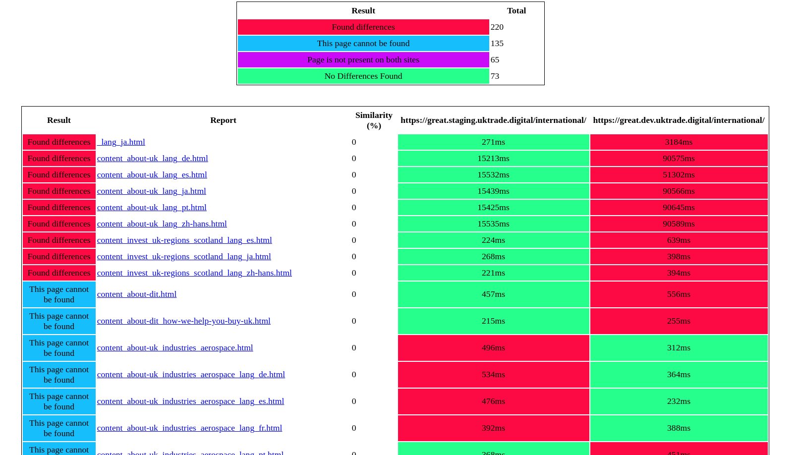

Content diff
------------

[./content_diff](./content_diff) is a simple test which looks for contents differences between Dev, Staging & Production
version of the same page.
At the moment it only compares selected Domestic & International pages.

This test uses:

## General requirements

* Python 3.8+
* [Python Behave](https://pypi.org/project/behave/) to run the tests
* [requests](http://docs.python-requests.org/en/master/) to fetch page contents
* Python's built-in [difflib](https://docs.python.org/3.8/library/difflib.html) to find & generate diff report


## Installation and execution

1. Create a dedicated virtualenv `mkvirtualenv -p python3.8 contentdiff` or use the same one as for other `periodic_tasks`
2. Install dependencies `make requirements_periodic_tasks` (or `pip install -r requirements_load.txt`)
3. Set required env vars using `periodic.sh` script (see [Env Vars](../../../README.md#env-vars) & [Convenience shell scripts](../../../README.md#Convenience-shell-scripts) sections in the main README)
4. Run the test with dedicated make target


### Running the content diff test

In order to run the test you'll need to specify for which site you want to run it and what two environments you want to compare:

```bash
SERVICE=international ENVS_TO_COMPARE=stage_dev \
    make compare_content
```

Possible values:

* SERVICE: `international` or `domestic`
* ENVS_TO_COMPARE:
    * `prod_uat`
    * `prod_stage`
    * `prod_dev`
    * `stage_uat`
    * `stage_dev`


### Report

Once the test is finished, a simple HTML report will be generated and saved in `./reports` directory.  
The report contains few metrics:L

* percentage similarity between two version of the page

Below is a an example of a content diff report summary:



And here's an example of a content difference between Dev & Staging version of the same page:

